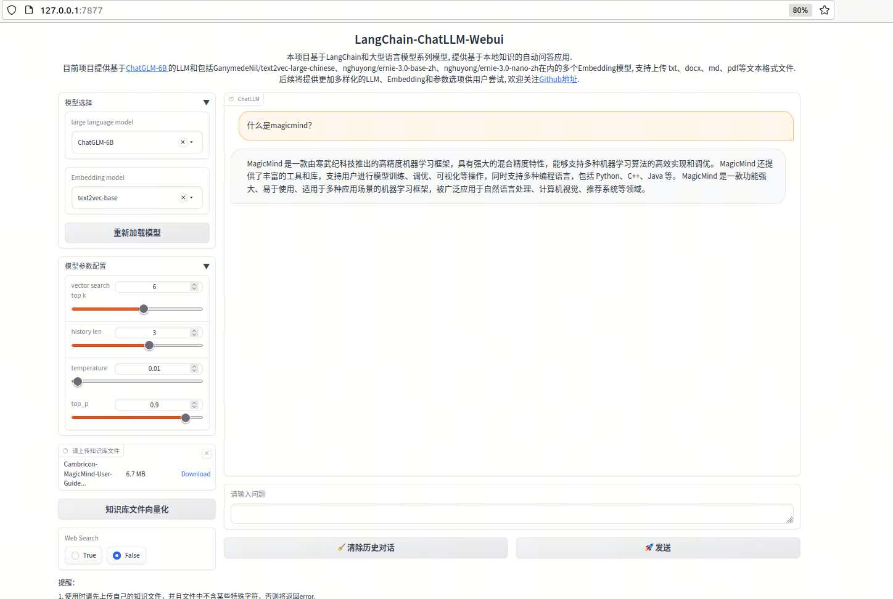

# langchain_chatglm6b

## 本代码为个人基于寒武纪设备对langchain chatglm的简单尝试

# 运行仓库的来源

## 1、LangChain-ChatGLM-Webui 仓库
   https://github.com/thomas-yanxin/LangChain-ChatGLM-Webui.git
   commit id: f2cd5cddeed14c3f786916e3b81a50906abd8feb
   git apply patch_LangChain-ChatGLM-Webui

## 2、修改依赖库unstructured
   https://github.com/Unstructured-IO/unstructured.git
   commit id 8b233b4f62feb5480cb8ce0f8009cf1aee02ff6f
   git apply patch_unstructured

# 模型准备：
## 1、chatglm 6b
   https://huggingface.co/THUDM/chatglm-6b
   commit id: 1d240ba371910e9282298d4592532d7f0f3e9f3e
## 2、text2vec-large-chinese
   https://huggingface.co/GanymedeNil/text2vec-large-chinese
   commit id: eb0ba6f8f02dcf960514fc55e4a3abd6cda6e0c5

# 基本环境获取：
   寒武纪pytorch1.9 1.15.0版本
   获取地址：https://sdk.cambricon.com/download?sdk_version=V1.13.0&component_name=PyTorch
   应为一些依赖库要用python3.8的语法，需要自己将寒武纪 pytorch 编译成python3.8版本

# 安装依赖库：
## 1、pip install -r requirements_mlu.txt --ignore-installed
## 2、cd unstructured
      pip install -e .

# 运行：
## 1、修改 LangChain-ChatGLM-Webui/config.py 中path to对应的chatglm 6b和text2vec-large-chinese的路径
## 2、python app.py

